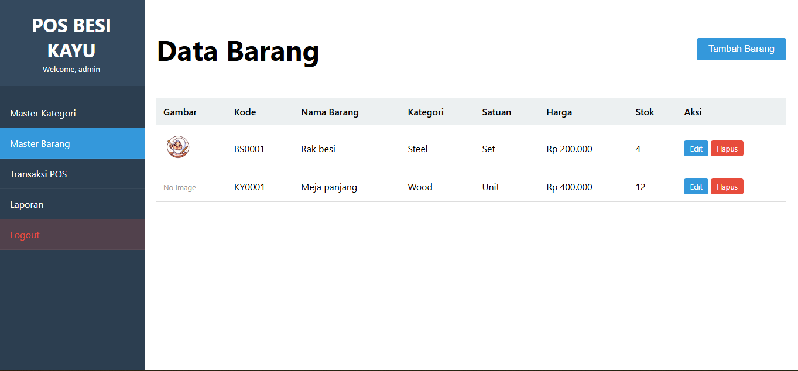

# POS Toko Besi & Kayu

Aplikasi Point of Sale (POS) sederhana namun profesional untuk toko penjualan barang besi dan kayu. Project ini dibangun dengan **PHP Native (Tanpa Framework)** dan **MySQL** dengan penerapan konsep **MVC (Model-View-Controller)** yang rapi, aman, dan mudah dijelaskan saat interview.

---

## 🌟 Fitur Utama
- **Login Multi-Role**: Sistem autentikasi aman untuk Admin.
- **Master Data**: Kelola Barang dan Kategori dengan validasi lengkap.
- **POS Modern**: Transaksi kasir dengan tampilan Grid responsif (Kotak-kotak), Keranjang Belanja, dan hitung kembalian otomatis.
- **Laporan**: Grafik penjualan interaktif (Harian/Bulanan) dan tabel detail transaksi.
- **Export Data**: Download laporan ke format Excel, CSV, dan PDF.
- **Upload Gambar**: Setiap produk memiliki gambar yang bisa diupload dan diganti.

---

## 📸 Screenshots
Berikut adalah tampilan aplikasi:

| Laporan (Dashboard) | Transaksi POS |
|---------------------|---------------|
|  |  |

| Master Barang | Master Kategori |
|---------------|-----------------|
|  |  |

---

## 🛠️ Teknologi yang Digunakan
Point penting untuk dijelaskan ke HRD/User:
- **Bahasa**: PHP Native (>= 7.4). "Murni tanpa framework, membuktikan pemahaman logika dasar yang kuat."
- **Database**: MySQL / MariaDB.
- **Arsitektur**: MVC (Model - View - Controller). "Memisahkan Logika, Data, dan Tampilan agar codingan rapi."
- **Keamanan**: PDO Prepared Statements (Anti SQL Injection) & Password Hashing.
- **Frontend**: HTML5, CSS3 Custom (Responsive), Javascript Vanilla, Chart.js.

---

## 📂 Bedah Struktur Folder (Panduan Interview)
Peta lokasi file untuk presentasi teknis:

### 1. Pintu Masuk (Entry Point)
*   **Lokasi**: `public/index.php`
*   **Fungsi**: Router / Pengatur Lalu Lintas. Semua request masuk lewat sini dulu.

### 2. Otak Aplikasi (Controllers)
*   **Lokasi**: `controllers/`
*   **Penjelasan**: Tempat logika bisnis berjalan.
    *   `BarangController.php`: validasi input, upload gambar.
    *   `PosController.php`: hitung total belanja, simpan transaksi.

### 3. Dapur Data (Models)
*   **Lokasi**: `models/`
*   **Penjelasan**: File yang boleh bicara langsung dengan Database (SQL).
    *   `BarangModel.php`: CRUD ke tabel barang.

### 4. Tampilan (Views)
*   **Lokasi**: `views/`
*   **Penjelasan**: File HTML murni untuk user interface.
    *   `views/pos/index.php`: Halaman Kasir.
    *   `views/barang/index.php`: Halaman Admin Barang.

---

## 💡 Contoh Penjelasan Logika (Studi Kasus)
Jika ditanya: *"Bagaimana alur Tambah Barang?"*

1.  **User Klik Simpan** di Modal -> Data dikirim ke `public/index.php`.
2.  **Router** mengarahkan ke `BarangController.php` fungsi `store()`.
3.  **Controller** melakukan validasi & upload gambar.
4.  **Model** (`BarangModel.php`) menyimpan data ke Database (`INSERT INTO...`).
5.  **Selesai**, user dikembalikan ke halaman utama.

---

## 🚀 Instalasi (Localhost)

1.  **Copy Folder**: Taruh folder `pos-besi-kayu` di `C:\xampp\htdocs\`.
2.  **Database**:
    - Buka phpMyAdmin, buat database `pos_besi_kayu`.
    - Import file `database/seed.sql` (Otomatis membuat tabel & data dummy).
3.  **Config**:
    - Cek `config/config.php`. Pastikan user/password database benar.
4.  **Jalankan**:
    - Buka browser: `http://localhost/pos-besi-kayu/public`
    - **Login**: Username `admin`, Password `admin123`.

---

## 🌐 Panduan Upload ke Hosting (Online)

Web ini sudah **"Hosting Ready"**. Langkah update ke server asli:

1.  **Database**: Buat database di hosting, import file `database/seed.sql`.
2.  **Upload**: Upload semua file project ke `public_html`.
3.  **Config**: Edit `config/config.php` di hosting. Sesuaikan User, Pass, dan Nama DB hosting.
    *   *Catatan*: `BASE_URL` akan otomatis mendeteksi domain, tidak perlu diedit manual.

---
*Created by Ilham Faishal*
