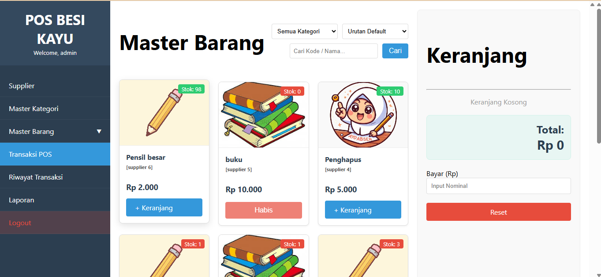
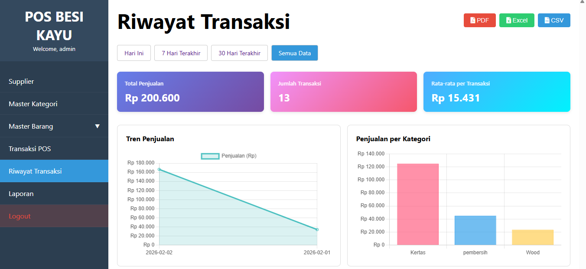
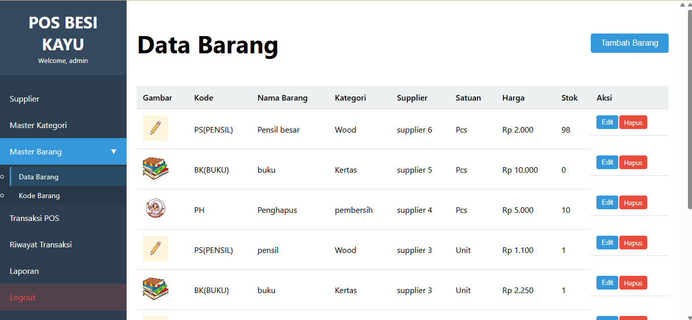
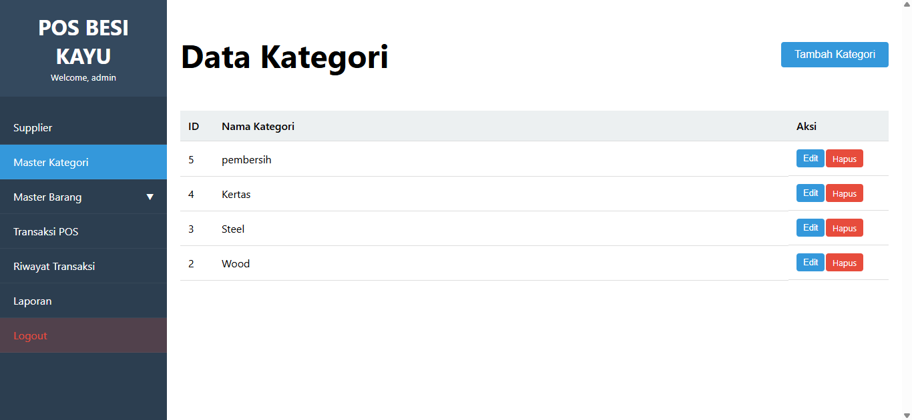
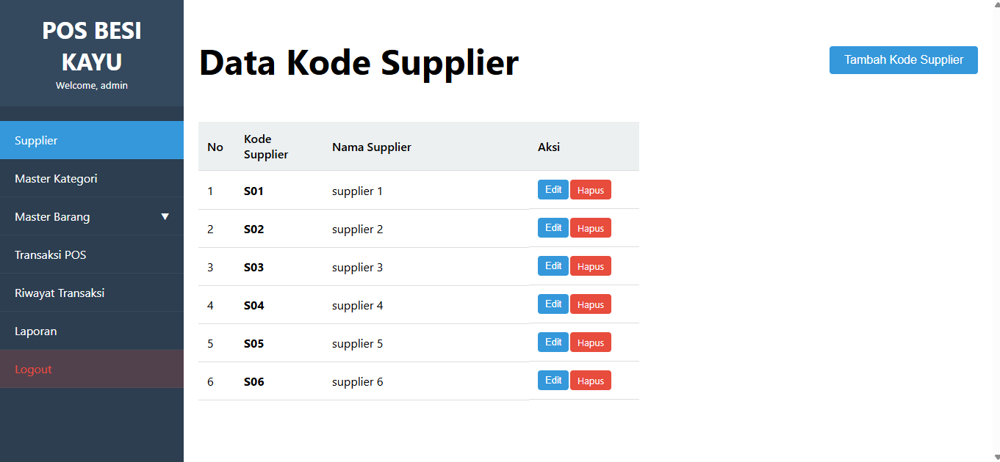
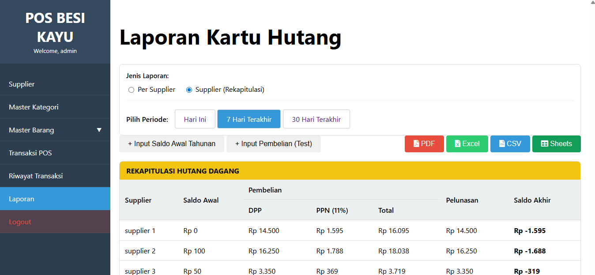

# POS Besi & Kayu

Aplikasi Point of Sales (POS) berbasis web untuk toko Bangunan (Besi & Kayu) yang memiliki fitur manajemen stok, hutang piutang supplier, dan transaksi penjualan kasir.

## Fitur Utama
*   **Kasir / POS**: Transaksi penjualan cepat dengan perhitungan otomatis.
*   **Manajemen Barang**: Kelola stok, harga, dan supplier barang.
*   **Kartu Hutang**: Laporan detail hutang ke supplier (Saldo Awal + Pembelian - Pembayaran).
*   **Laporan**: Rekapitulasi transaksi harian, bulanan, dan tahunan.
*   **Export Excel**: Download laporan dan riwayat transaksi dalam format Excel yang rapi.

## Tampilan Aplikasi (UI)

Berikut adalah tampilan antarmuka dari aplikasi:

### 1. Transaksi Kasir (POS)
Halaman utama untuk melakukan penjualan barang.

### 2. Riwayat Transaksi
Melihat history penjualan dan cetak struk/laporan.

### 3. Data Barang
Manajemen stok inventory toko.

### 4. Kategori Barang
Pengelompokan jenis barang (Besi, Kayu, Paku, dll).

### 5. Data Supplier
Manajemen data pemasok barang.

### 6. Laporan & Kartu Hutang
Monitoring hutang usaha dan rekap pembelian.

## Instalasi
1.  Import database `database/database.sql` ke MySQL.
2.  Atur koneksi database di `config/Database.php` (jika ada) atau sesuaikan environment.
3.  Jalankan di local server (XAMPP/Laragon).

---
*Created for Digital Market Project.*
